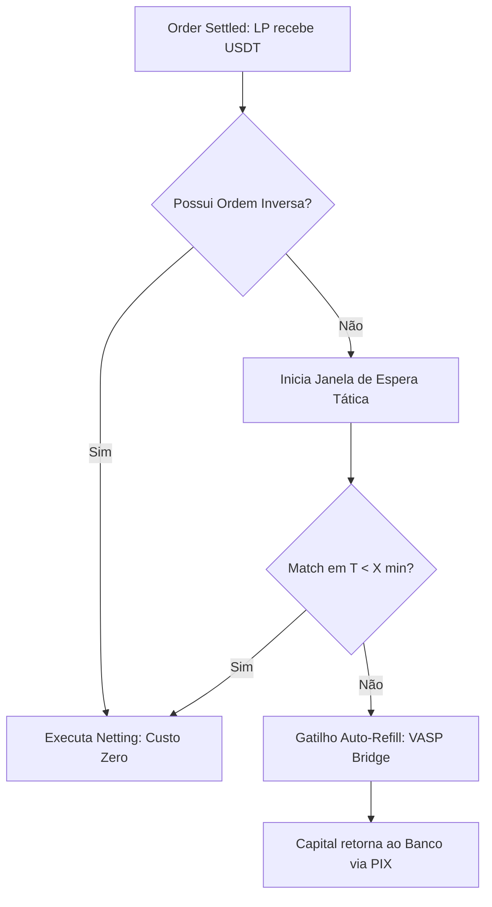

# Especificação Técnica: Painel de Alocação Tática (LP Dashboard)
**Versão:** 1.0 | **Estatus:** Proposta de Interface / Engenharia

---

## 1. Objetivo
Desenvolver uma interface de controle para o **Provedor de Liquidez (LP)** que permita a gestão dinâmica do capital entre os modos de **Auto-Refill** (Saída Instantânea) e **Netting** (Aproveitamento de Ordens Inversas), utilizando dados preditivos para maximizar o ROI.

---

## 2. Componentes da Interface (UI)

### 2.1 Módulo de Forecasting (Previsão)
O motor Antigravity utiliza o histórico de GTV do corredor para exibir um **Heatmap de Probabilidade**.
- **Visual:** Gráfico de ondas (Waveform) mostrando a densidade de ordens nas últimas 24h e a projeção para as próximas 4h.
- **KPI:** `% de Chance de Netting`. Indica a probabilidade estatística de uma ordem inversa ocorrer dentro da janela de tempo configurada.

### 2.2 Controle de Alocação Híbrida (The Slider)
Mecanismo central de decisão do LP.
- **Modo Manual:** O LP define uma porcentagem fixa (ex: 70% Auto-Refill / 30% Netting).
- **Modo Smart (AI):** O sistema ajusta a alocação automaticamente com base no custo de gas e na densidade do corredor.
- **Time-Out Configurável:** Definição da "Janela de Espera" (ex: "Se não houver match reverso em 45 min, execute o Rebuy via VASP").

### 2.3 Visualizadores de Capital Efficiency
- **Widget de Giro (Cycle Time):** Tempo real decorrido desde o último payout até o retorno do capital para a conta Fiat.
- **Widget de Economia (Fee Savings):** Valor total economizado ao evitar as taxas de spread das VASPs via Netting.

---

## 3. Lógica de Backend (Smart Allocation Logic)

### 3.1 O Algoritmo de "Fallback"

### 3.2 Regras de Negócio para Janela de Espera
- **Prioridade:** Ordens que entram na Janela de Espera têm prioridade absoluta no Matching Engine sobre novos LPs para incentivar a re-liquidação orgânica.
- **Limite de Segurança:** Se a volatilidade do par USDT/BRL exceder 0.2% em 15 minutos, a Janela de Espera é abortada e o Auto-Refill é executado para proteger o principal do LP.

---

## 4. Métricas Exibidas (Dashboard Main View)

| Métrica | Descrição |
| :--- | :--- |
| **Current Liquidity (FIAT)** | Saldo disponível no banco parceiro. |
| **Locked Collateral (USDT)** | Valor travado em ordens em processamento. |
| **Tactical Reserve (USDT)** | Fundos na Janela de Espera aguardando Netting. |
| **Today's GTV** | Volume total processado no dia. |
| **Daily Yield (Net)** | Lucro líquido após custos de rede e VASP. |

---

*Documento de Design de Produto FLUXUS.*
*Autor: Antigravity AI Engine.*
