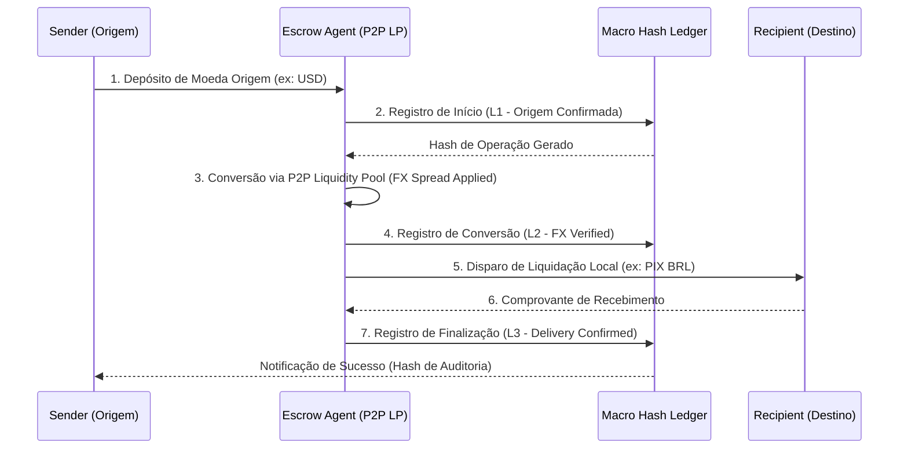

# FLUXUS Remit: Arquitetura Técnica do Fluxo

O fluxo de remessa no FLUXUS é tratado como uma sucessão de eventos de ledger auditados pelo sistema **Macro Hash (L1→L5)**. A arquitetura garante que a liquidez P2P seja utilizada de forma eficiente e segura.

## 1. Mapeamento do Fluxo (Workflow)

## 2. Integração com o Sistema MACRO HASH
Cada remessa internacional é encapsulada em um bloco de auditoria SHA-256:

| Nível | Evento Técnico | Garantia Regulatória |
| :--- | :--- | :--- |
| **L1** | `INIT_REMIT` | Prova de origem dos fundos e KYC do remetente. |
| **L2** | `EXCHANGE_FIX` | Registro da taxa de câmbio aplicada e spread do investidor. |
| **L3** | `LOCAL_AUTH` | Autorização do Provedor de Liquidez P2P local. |
| **L4** | `SETTLE_DISBURSE` | Hash do comprovante de transferência bancária no destino (PIX/BS2). |
| **L5** | `FINAL_COMPLIANCE` | Consolidação para reporte ao BACEN/COAF. |

## 3. Motor de Liquidez P2P (FX Engine)
Diferente de um CDB ou título de dívida, o capital em Remessa funciona em uma **Fila de Execução**:

1. **Pooling:** O investidor aloca R$ 10.000,00 no Corredor `USA-BR`.
2. **Matching:** O motor de câmbio (Celery Task) identifica remessas pendentes e "consome" a liquidez deste pool.
3. **Settlement:** O investidor é reembolsado no saldo de conta com o Principal + Spread assim que a remessa é concluída no destino.

## 4. Stack Tecnológica Envolvida
- **FastAPI (Ledger Service):** Gerencia as rotas de auditoria e geração dos hashes da remessa.
- **Celery + Redis:** Orquestra as operações assíncronas de fechamento de câmbio e disparo de webhooks de pagamento.
- **PostgreSQL (JSONB Ledger):** Armazena os metadados complexos de cada remessa para rastreabilidade futura.

## 5. Próximos Passos para o Protótipo
- Adaptar a **Tela de Dashboard do Aplicante** para mostrar a aba "Remit Liquidity".
- Criar a **Tela de Cotação de Remessa** (Sender Preview).
